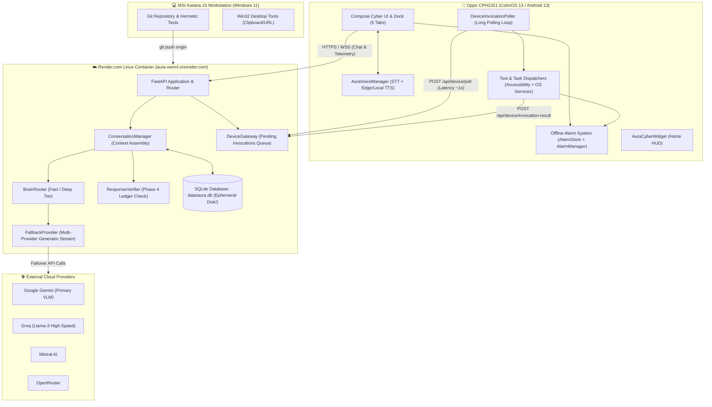
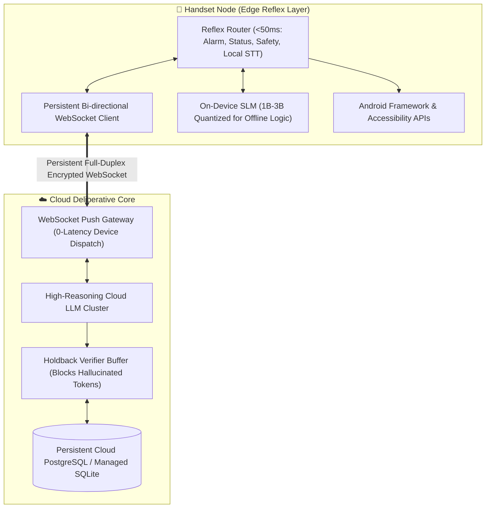

# BẢN KIỂM KÊ KỸ THUẬT VÀ TRẠNG THÁI HIỆN TẠI HỆ THỐNG AURA
**Tài liệu Nguồn Sự Thật Duy Nhất (Single Source of Truth - SSOT) về Kiến trúc, Tính năng, Bằng chứng Kiểm thử và Hạn chế Kỹ thuật**

---

## 1. THÔNG TIN METADATA VÀ PHẠM VI AUDIT

- **Dự án**: Aura — Trợ lý AI Cá nhân Đồng hành & Đặc vụ Tự trị Đa Thiết bị (Personal AI Companion & Autonomous Agent)
- **Ngày thực hiện kiểm toán**: 2026-10-02
- **Phiên bản Git (Commit Hash)**: `96ad10b42adb7466393403feda436cd78df7f7a2`
- **Nhánh Git (Branch)**: `feature/aura-identity` (Trạng thái working tree: sạch sẽ, không có thay đổi chưa commit)
- **Môi trường Triển khai Thực tế (Tri-Node Architecture)**:
  1. **Node Máy chủ Đám mây (Cloud Host)**: Linux Container triển khai trên nền tảng **Render.com** (`https://aura-xwm4.onrender.com/`). Môi trường Linux x86_64, 512MB RAM, hệ thống tệp tin tạm thời (ephemeral disk), Python 3.12, Uvicorn/FastAPI.
  2. **Node Thiết bị Di động (Mobile Companion)**: Thiết bị vật lý **Oppo CPH2251** (ColorOS 13, Android 13, MediaTek Dimensity 900, 8GB RAM, kết nối WAN HTTPS/WSS qua Render, Device ID ADB: `IBCQMB4PTGNZJVTO`, tiến trình APK đã cài đặt `com.aura.companion` PID `17760` verified hoạt động ổn định với 0 crash).
  3. **Node Máy trạm Phát triển (Dev Workstation)**: Laptop **MSI Katana 15** (Windows 11 x64, Intel Core i7, NVIDIA RTX 4060, Python 3.12 venv, ADB client, Gradle 8.x).
- **Mục tiêu Kiểm toán**: Bản kiểm kê kỹ thuật trung thực, nghiêm ngặt, dựa trên 100% bằng chứng mã nguồn, log runtime và kết quả kiểm thử thực tế. Không sử dụng ngôn ngữ quảng cáo, không giả định bất kỳ tính năng nào hoạt động khi chưa có bằng chứng xác thực.
- **Cam kết Tuyệt đối**: **AUDIT VÀ TÀI LIỆU HÓA DUY NHẤT (DOCUMENTATION ONLY). KHÔNG CHỈNH SỬA BẤT KỲ MÃ NGUỒN NÀO.**

---

## 2. PHÂN HỆ CỐT LÕI VÀ CẤU TRÚC TỆP TIN THỰC TẾ

Cấu trúc cây thư mục thực tế của dự án Aura được tổ chức thành 8 phân hệ cốt lõi:

```
d:\AURA\
├── agent/                  # Hệ thống đặc vụ tự trị, lập kế hoạch và thực thi tác vụ bền vững
│   ├── runtime.py          # AgentRuntime: Vòng lặp quan sát -> suy luận -> công cụ (deferred mode)
│   ├── task_runtime.py     # DurableTaskRuntime: Máy trạng thái tác vụ đa bước lưu trữ SQLite
│   ├── intent_planner.py   # Bộ phân rã ý định tự nhiên thành danh sách bước thực thi
│   └── recovery.py         # Chiến lược khôi phục và sửa lỗi khi công cụ thất bại
├── android/                # Mã nguồn ứng dụng Android Companion Native (Kotlin + Jetpack Compose)
│   ├── app/src/main/java/com/aura/companion/
│   │   ├── alarm/          # Hệ thống báo thức native 100% offline (AlarmScheduler, AlarmStore, AuraAlarmActivity)
│   │   ├── api/            # Retrofit REST client (AuraApi, DTOs, SSE streaming client)
│   │   ├── device/         # Cầu nối thiết bị: Poller, ToolDispatcher, TaskDispatcher, AccessibilityService
│   │   ├── service/        # Dịch vụ nền: FloatingChatService, AuraTileService (Quick Settings)
│   │   ├── ui/             # Giao diện Cyberpunk Compose: AuraIcons, AuraCyberDock, ChatScreen, HubScreen
│   │   ├── voice/          # Bộ máy giọng nói: AuraVoiceManager (STT tiếng Việt, Edge TTS, Local TTS fallback)
│   │   ├── widget/         # Tiện ích Cyber HUD màn hình chính (AuraCyberWidgetProvider)
│   │   └── work/           # WorkManager: NotificationWorker, DirectReplyReceiver
├── brain/                  # Bộ não AI, định tuyến mô hình, suy luận và xác thực câu trả lời
│   ├── conversation.py     # ConversationManager: Quản lý lượt hội thoại, context assembly, streaming
│   ├── router.py           # BrainRouter: Phân tích intent, chọn model tier (FAST vs DEEP)
│   ├── providers/          # Adapter kết nối các nhà cung cấp LLM (Gemini, Groq, Mistral, OpenRouter)
│   │   └── fallback.py     # FallbackProvider: Cơ chế chuyển đổi dự phòng và stream failover
│   ├── verify/             # Hệ thống xác minh phản hồi dựa trên bằng chứng (Phase 4 Response Verifier)
│   │   ├── verify.py       # ResponseVerifier: So khớp phát ngôn với bảng chứng cớ (EvidenceLedger)
│   │   ├── ledger.py       # EvidenceLedger: Bảng lưu trữ bằng chứng thực tế từ kết quả công cụ
│   │   ├── claims.py       # Trích xuất phát ngôn hành động từ văn bản sinh ra bởi LLM
│   │   └── repair.py       # Sửa đổi câu chữ phát ngôn sai lệch / ảo giác
│   └── synthesizer.py      # Dynamic Tool Synthesizer: Tự sinh công cụ Python theo yêu cầu
├── core/                   # Hạt nhân hệ thống, định nghĩa năng lực và cấu hình
│   ├── capabilities/       # Capability Registry, Health Checks, Permission Checks
│   │   ├── factory.py      # Đăng ký tập trung 35+ capabilities của hệ thống
│   │   ├── registry.py     # Kho lưu trữ và tra cứu capability động
│   │   └── models.py       # Lớp dữ liệu Capability, CapabilityStatus, Permission
│   ├── hardware_probe.py   # Thăm dò phần cứng máy chủ (CPU, RAM, Disk, OS specs)
│   └── config.py           # Quản lý cấu hình toàn cục từ file YAML và biến môi trường
├── memory/                 # Hệ thống lưu trữ và truy hồi trí nhớ đa tầng
│   ├── sqlite.py           # Khởi tạo schema SQLite và quản lý session ORM
│   ├── graph.py            # Entity Knowledge Graph (Node, Relation, Subgraph 1-hop)
│   ├── semantic.py         # Semantic Vector Store & Hybrid Search (RRF ranking)
│   ├── embeddings.py       # Sinh embedding vector (Local hash, Ollama, Remote)
│   ├── reflection.py       # EpisodicReflectionWorker: Trích xuất tri thức ngầm sau hội thoại
│   ├── sanitizer.py        # SensitiveDataSanitizer: Làm sạch thẻ tín dụng, API keys, mật khẩu
│   └── companion_sqlite.py # Lưu trữ mục tiêu (goals), dự án và phong cách cá nhân
├── proactive/              # Bộ máy chủ động tương tác không cần kích hoạt
│   ├── decision.py         # Đánh giá điều kiện kích hoạt thông báo chủ động
│   ├── policy.py           # Chính sách giãn cách (cooldown) theo từng chủ đề
│   ├── goals.py            # Thu thập mục tiêu còn dang dở làm chất liệu nhắc việc
│   ├── topics.py           # Thu thập tiến độ trong ngày làm chất liệu tổng kết buổi tối
│   └── messages.py         # Soạn thảo câu thông báo tự nhiên chuẩn ngôn ngữ tiếng Việt
├── server/                 # Cổng dịch vụ web FastAPI và quản lý vòng đời ứng dụng
│   ├── main.py             # Khởi tạo FastAPI app, middleware CORS, lifespan context
│   ├── runtime.py          # ServerRuntime: Wiring toàn bộ services, allowlist tools, engine
│   ├── gateway.py          # DeviceGateway: Hàng đợi chỉ lệnh điều khiển thiết bị di động
│   └── routes/             # REST & WebSocket endpoints (chat, ws_chat, agent, device, memory, voice, system)
└── tools/                  # Hạ tầng thực thi công cụ và bộ thư viện công cụ tích hợp
    ├── base.py             # Lớp cơ sở Tool, ToolResult, Parameter, ToolRisk
    ├── outcome.py          # Cấu trúc bằng chứng: Evidence, SideEffect, Retryability
    ├── executor.py         # ToolExecutor: Cổng kiểm duyệt quyền hạn, timeout và logging
    ├── builtins/           # Thư viện công cụ cài sẵn (desktop, web, workspace, memory, sandbox)
    └── providers/          # Cầu nối thiết bị di động (AndroidProvider, AndroidTaskProvider, AndroidBridge)
```

---

## 3. TRACE RUNTIME THỰC TẾ (CALL STACKS & DATA TRANSITIONS)

### Trace 1: Luồng Trò Chuyện Trực Tiếp (Chat Stream Path)
*Giao thức*: HTTP SSE (`POST /api/chat`) hoặc WebSocket (`/api/chat/ws`).

1. **Khách hàng gửi yêu cầu**: Android App hoặc Web gửi payload `ChatRequest(message="...", image=None, session_id="...")`.
2. **Server Tiếp nhận**: `server/routes/chat.py` (hoặc `ws_chat.py`) nhận request, xác thực token qua `server/auth.py`.
3. **Điều phối Hội thoại**: Chuyển giao sang `ConversationManager.handle_message()` (`brain/conversation.py`).
4. **Chuẩn bị Ngữ cảnh (Context Assembly)**:
   - Trích xuất lịch sử từ bảng SQLite `messages` (`memory/sqlite.py`).
   - Truy vấn facts người dùng và 1-hop Entity Graph (`memory/knowledge.py`).
   - Truy vấn vector tương đồng từ `semantic_vectors` (`memory/semantic.py`).
   - Ghép nối thông tin phần cứng máy chủ (`core/hardware_probe.py`).
   - Nạp hướng dẫn toàn cục từ `prompts/system.md`.
5. **Suy luận & Sinh Token (Generation Loop)**:
   - `BrainRouter` định tuyến tới `FallbackProvider` (`brain/providers/fallback.py`).
   - `FallbackProvider.stream()` gọi provider ưu tiên (ví dụ `GeminiProvider`).
   - Nếu provider ném lỗi ngắt quãng hoặc không hỗ trợ stream, tự động failover sang `GroqProvider` -> `MistralProvider` -> `OpenRouterProvider`.
6. **Thực thi Công cụ (Tool Call Execution)**:
   - Nếu LLM trả về lệnh gọi function calling (native tool call):
   - Chặn stream, chuyển lệnh sang `ToolExecutor.execute()` (`tools/executor.py`).
   - `ToolExecutor` kiểm tra quyền hạn, ghi vết `ToolInvocationEvent`, sinh `ToolResult` kèm `Evidence`.
   - Kết quả công cụ được nạp lại vào transcript và gửi ngược cho LLM tiếp tục sinh câu trả lời.
7. **Bắn Token Trực Tiếp (Token Streaming)**:
   - Các mảnh token (`resolved_text`) được `yield` trực tiếp ra socket/SSE và gửi ngay lập tức về UI khách hàng (`brain/conversation.py:460`).
8. **Xác minh Sau Luồng (Post-Stream Verification - Phase 4)**:
   - Khi generator hoàn tất toàn bộ chuỗi token (`pieces`), `self._verify_final(text, turn)` được gọi (`brain/conversation.py:481`).
   - `ResponseVerifier.verify()` đối chiếu văn bản với `EvidenceLedger`.
   - Ghi nhớ vào SQLite `_remember(user_msg, verified)`.
   - Phát sự kiện kết thúc `StreamFinishedEvent(text=verified, verifier=summary)`.
   - **LƯU Ý KỸ THUẬT QUAN TRỌNG**: Do token đã được stream về màn hình người dùng trong lúc sinh, UI đã hiển thị các từ ngữ thô. Nếu có lỗi ảo giác, UI chỉ có thể thay thế toàn bộ khối văn bản khi nhận được `StreamFinishedEvent`. Đây là một khoảng trống kiến trúc (race condition) vốn có của mô hình stream trực tiếp.

### Trace 2: Luồng Tác Vụ Đặc Vụ Tự Trị (Agent Intent Path)
*Giao thức*: HTTP REST (`POST /api/agent/intent`).

1. **Khách hàng gửi yêu cầu**: Client gửi `{ "intent": "đặt báo thức 7h sáng mai", "session_id": "...", "durable": false }`.
2. **Tiếp nhận & Định tuyến**: `server/routes/agent.py::agent_intent()`.
3. **Khởi tạo Vòng lặp Suy luận**:
   - `IntentRuntime.run_to_completion()` (`agent/runtime.py`).
   - Mô hình `RouterToolCallingLLM` nạp danh sách công cụ từ `get_device_registry()`.
4. **Vòng lặp Thực thi Đa bước (Multi-Step Execution Loop)**:
   - Mô hình chọn công cụ (ví dụ `android.set_alarm`).
   - Gọi `ToolExecutor.execute()`.
   - Lệnh được đẩy vào `GatewayDeviceBridge` -> chờ điện thoại xử lý.
   - Khi có kết quả kèm `postcondition` xác thực, vòng lặp tiếp tục bước tiếp theo.
5. **Đồng bộ Xác minh Câu trả lời Hoàn tất**:
   - Khi mô hình dừng (StopReason = `GOAL_VERIFIED`), chuỗi trả lời tổng kết `reply` được trích xuất.
   - Hàm `_verify_run_reply(reply, run)` được gọi trực tiếp (`server/routes/agent.py:450`).
   - `ResponseVerifier` kiểm tra toàn bộ phát ngôn hành động với `EvidenceLedger`.
   - Câu trả lời đã được làm sạch và xác thực được đóng gói vào JSON phản hồi HTTP `{"reply": reply, "grounded": true, "verifier": summary}`.
   - Khác với Chat Stream, ở luồng Agent Intent, người dùng **không bao giờ** nhìn thấy văn bản sai lệch vì việc xác minh diễn ra hoàn tất trước khi trả HTTP response.

### Trace 3: Luồng Thực Thi Công Cụ Thiết Bị Di Động (Android Device Invocation Path)
*Giao thức*: Long Polling HTTP giữa Server Render và Điện thoại Oppo CPH2251.

1. **LLM Phát Lệnh**: LLM sinh chỉ lệnh `android.tap(node_id="btn_submit")` hoặc `android.set_alarm(time="07:00")`.
2. **Cầu Nối Máy Chủ**:
   - `AndroidProvider` (cho Accessibility) hoặc `AndroidTaskProvider` (cho Task).
   - Gọi `GatewayDeviceBridge.invoke()` (`tools/providers/android_bridge.py`).
3. **Đưa vào Hàng Đợi Gateway**:
   - `DeviceGateway.enqueue_invocation()` gán `invocation_id`, lưu trữ future và đưa vào hàng đợi `_pending_invocations`.
4. **Điện Thoại Kéo Chỉ Lệnh (Polling Loop)**:
   - Trên điện thoại, `DeviceInvocationPoller` chạy coroutine nền gửi `POST /api/device/poll`.
   - Máy chủ rút chỉ lệnh từ hàng đợi và trả về JSON cho điện thoại.
5. **Điều Phối và Thực Thi Phía Android**:
   - `DeviceToolDispatcher.dispatch()` nhận chỉ lệnh.
   - Nếu là công cụ Accessibility: Gọi `AuraAccessibilityService` tương tác trực tiếp lên cây `AccessibilityNodeInfo` hoặc thực hiện `dispatchGesture`.
   - Nếu là công cụ Task: Gọi `DeviceTaskDispatcher` tương tác với Android Framework (`AlarmManager`, `ClipboardManager`, `CameraManager.setTorchMode`, `ContentResolver`).
6. **Kiểm Tra Hậu Điều Kiện (Postcondition Verification)**:
   - Android kiểm tra xem trạng thái thế giới thực đã thay đổi hay chưa (ví dụ: cờ `isTorchOn` đã đổi, node mới đã xuất hiện trên màn hình, báo thức đã ghi vào SQLite `AlarmStore`).
   - Đóng gói kết quả: `{ "ok": true, "postcondition": { "verified": true, "details": "..." } }`.
7. **Báo Cáo Kết Quả Lên Máy Chủ**:
   - Điện thoại gửi `POST /api/device/invocation-result`.
   - `DeviceGateway` nhận kết quả, kích hoạt future đang chờ, unblock `GatewayDeviceBridge`.
   - Chuyển đổi thành `ToolResult` chứa `Evidence(kind=EvidenceKind.POSTCONDITION)`.

---

## 4. BẢNG KIỂM KÊ TÍNH NĂNG TOÀN DIỆN (FEATURE INVENTORY TABLE)

Phân loại trạng thái kỹ thuật tuân thủ nghiêm ngặt:
- `WORKING`: Đã chứng minh hoạt động hoàn chỉnh, có test và chạy thực tế.
- `PARTIAL`: Hoạt động một phần, có giới hạn hoặc điều kiện ràng buộc.
- `IMPLEMENTED_NOT_E2E`: Đã viết code/interface đầy đủ nhưng chưa kiểm thử trọn vẹn đầu cuối.
- `EXPERIMENTAL`: Tính năng thử nghiệm, có thể thay đổi hoặc chưa ổn định.
- `BROKEN`: Code đang lỗi hoặc không thể vận hành bình thường.
- `BLOCKED`: Bị phụ thuộc vào môi trường/hạ tầng chưa đáp ứng.
- `UNVERIFIED`: Chưa đủ dữ liệu/bằng chứng để kết luận.

| Phân hệ | Tên Tính Năng | Trạng Thái | Bằng Chứng Mã Nguồn | Đường Dẫn Runtime | Bằng Chứng Test | Giới Hạn Hiện Tại | Rủi Ro Kỹ Thuật |
| :--- | :--- | :--- | :--- | :--- | :--- | :--- | :--- |
| **Brain** | Multi-Provider Failover | `WORKING` | `brain/providers/fallback.py` | `FallbackProvider.generate()` | `tests/test_fallback_stream.py` | Cần ít nhất 1 API key khả dụng | Cạn hạn mức (Quota 429) đồng loạt |
| **Brain** | Multi-Provider Streaming | `WORKING` | `brain/providers/fallback.py` | `FallbackProvider.stream()` | `tests/test_fallback_stream.py` (5/5 passed) | Failover giữa chừng làm gián đoạn câu | Chuyển provider giữa chừng có thể lặp ý |
| **Brain** | Multimodal Vision in Chat | `WORKING` | `gemini.py`, `models.py` | `POST /api/chat`, `Part.from_bytes` | `tests/test_multimodal_vlm.py` (4/4 passed) | Giới hạn 12MB base64 / 8MB raw | Tràn RAM 512MB trên Render nếu ảnh lớn |
| **Brain** | Dynamic Tool Synthesis | `PARTIAL` | `brain/synthesizer.py` | `synthesize_tool_for_goal()` | `tests/test_tool_synthesizer.py` | Chỉ sinh Python thuần, lưu SQLite | Nguy cơ chạy mã không kiểm soát nếu sandbox hở |
| **Brain** | Response Verifier (Phase 4) | `PARTIAL` | `brain/verify/verify.py` | `_verify_final()`, `_verify_run_reply()` | `tests/test_response_verifier.py` (68/68 passed) | Streaming tokens ra trước khi verify; chỉ bắt từ khóa | Lọt ảo giác nếu văn bản dùng từ đồng nghĩa lạ |
| **Memory** | SQLite Core Memory & Sessions | `WORKING` | `memory/sqlite.py` | `SessionManager`, `SQLAlchemy` | `tests/test_sqlite_memory.py` | Lưu file local `data/aura.db` | Render free-tier xóa sạch DB khi redeploy |
| **Memory** | Entity Knowledge Graph | `WORKING` | `memory/graph.py` | `EntityGraphStore.query_subgraph` | `tests/test_entity_graph.py` (4/4 passed) | Tối đa 1-hop liên kết hiện tại | Chưa tự động gom cụm thực thể đồng nghĩa |
| **Memory** | Semantic Vector Search | `WORKING` | `memory/semantic.py` | `SemanticVectorStore.search()` | `tests/test_semantic_memory.py` (43/43 passed) | RRF k=60.0, tự động init table | Embedding hashing địa phương chất lượng vừa phải |
| **Memory** | Episodic Reflection Worker | `WORKING` | `memory/reflection.py` | `EpisodicReflectionWorker.extract()` | `tests/test_memory_knowledge_graph.py` | Chạy bất đồng bộ ngầm sau hội thoại | Tốn thêm token LLM nếu dùng LLM fallback |
| **Memory** | Sensitive Data Sanitizer | `WORKING` | `memory/sanitizer.py` | `SensitiveDataSanitizer.redact()` | `tests/test_sensitive_sanitizer.py` (4/4 passed) | Regex + Luhn phát hiện CC, Keys, Pass | Có thể chặn nhầm số thẻ hội viên thông thường |
| **Memory** | Memory Backup & Export API | `WORKING` | `server/routes/memory.py` | `GET /api/memory/export` | `tests/test_memory_api.py` (5/5 passed) | Xuất toàn bộ JSON gồm Graph & Facts | File xuất lớn nếu chat lâu năm |
| **Tools** | Web Search (DuckDuckGo Lite) | `WORKING` | `tools/builtins/web.py` | `WebSearchTool.execute()` | `tests/test_web_tools.py` (10/10 passed) | Phụ thuộc HTML layout của DDG Lite | Bị rate-limit nếu search tần suất cao |
| **Tools** | Safe Web Content Fetcher | `WORKING` | `tools/builtins/web.py` | `FetchWebContentTool.execute()` | `tests/test_web_tools.py` | Chặn SSRF loopback/private IP, max 2MB | Không render được trang SPA chỉ có JS |
| **Tools** | Workspace Git & Filesystem | `WORKING` | `tools/builtins/workspace.py` | `WorkspaceGitStatusTool`, diff, search | `tests/test_workspace_tools.py` (10/10 passed) | Bị giới hạn nghiêm ngặt trong PROJECT_ROOT | Chỉ hoạt động trên máy Dev trạm có repo |
| **Tools** | Desktop Win32 Clipboard | `WORKING` | `tools/builtins/desktop.py` | `desktop.set_clipboard`, get | `tests/test_clipboard_sync.py` (6/6 passed) | Chỉ chạy trên Windows x64 | Xung đột handle nếu app khác đang giữ lock |
| **Tools** | Python Code Sandbox | `EXPERIMENTAL`| `tools/builtins/sandbox.py` | `SandboxPythonTool.execute()` | `tests/test_sandbox_tool.py` | AST whitelist, chặn builtins nguy hiểm | Không phải jail an toàn tuyệt đối cấp OS |
| **Android** | 15 Accessibility Tools | `PARTIAL` | `android_provider.py`, `AuraAccessibilityService` | DeviceGateway Long Polling | Unit tests pass, manual ADB pass | Cần bật quyền Accessibility thủ công | Ứng dụng bị OEM kill ngầm làm mất kết nối |
| **Android** | 7 Task Tools (Alarm, Flash, ...) | `WORKING` | `android_task_provider.py`, `DeviceTaskDispatcher` | DeviceGateway Long Polling | `tests/test_android_task_tools.py` (15/15 passed) | Cần cấp các quyền Android tương ứng | Người dùng từ chối quyền thì tool trả UNAVAILABLE |
| **Android** | Offline Cyber Alarm System | `WORKING` | `android/companion/alarm/` | `AlarmManager.setAlarmClock()` | `AlarmStoreTest.kt`, Python 8/8 passed | Báo thức độc lập 100% offline | OEM tối ưu pin quá mức có thể hoãn alarm |
| **Android** | Edge Neural TTS Voice | `WORKING` | `AuraVoiceManager.kt`, `voice.py` | `MediaPlayer` stream `/api/voice/tts` | `tests/test_server_voice_route.py` (4/4 passed) | Cần mạng; tự động fallback native TTS | Mạng chập chờn gây trễ tiếng 1-2s |
| **Android** | Native STT (Tiếng Việt) | `WORKING` | `AuraVoiceManager.kt` | `SpeechRecognizer.startListening()` | `AuraVoiceManagerTest.kt` | Phụ thuộc Google Speech Services trên máy | Tạp âm môi trường ảnh hưởng độ chính xác |
| **Android** | Hands-Free Walkie-Talkie Mode| `WORKING` | `ChatViewModel.kt`, `AuraVoiceManager` | Vòng lặp STT -> Chat -> TTS -> STT | `AuraVoiceManagerTest.kt` | Delay 400ms chống echo; phát hiện từ thoát | Người dùng nói chen ngang khi đang phát chưa ngắt |
| **Android** | Quick Settings Tile & Shortcuts | `WORKING` | `AuraTileService.kt`, `shortcuts.xml` | `TileService`, Launcher static shortcuts | `AuraTileServiceTest.kt`, Contract test | Cần kéo thanh cài đặt để kích hoạt | Một số launcher bên thứ ba không hỗ trợ shortcut |
| **Android** | Cyber HUD Home Widget | `WORKING` | `AuraCyberWidgetProvider.kt` | Native `AppWidgetProvider` + RemoteViews | `AuraCyberWidgetProviderTest.kt` | Cập nhật định kỳ hoặc theo broadcast | Giới hạn khả năng tùy biến của RemoteViews |
| **Android** | Floating Chat Bubble | `PARTIAL` | `FloatingChatService.kt` | `WindowManager.addView` | `NotificationsSection.kt` | Cần quyền vẽ đè (SYSTEM_ALERT_WINDOW) | Một số ROM Android 14 chặn FGS đặc biệt |
| **Proactive**| Unprompted Context Notifications| `WORKING`| `proactive/decision.py`, `NotificationWorker` | Periodic WorkManager -> Server evaluate | `tests/test_proactive_upgrade.py` (12/12 passed) | Cooldown 8-12 tiếng mỗi chủ đề | Nếu không tương tác thường xuyên sẽ thiếu ngữ cảnh |
| **System** | Dual-Device Telemetry HUD | `WORKING` | `system.py`, `DeviceTelemetryProbe.kt` | `GET /api/system/telemetry` | `tests/test_hardware_probe.py` | Đo ping, pin, CPU, RAM của cả 2 node | Server Render không đo được nhiệt độ phần cứng |
| **System** | Self-Restart & Settings API | `WORKING` | `server/routes/settings.py` | `POST /api/settings/restart` | `tests/test_settings_api.py` (194/194 passed) | FastAPI background task, bypass trong test | Render container tự boot lại khi process thoát |

---

## 5. SƠ ĐỒ KIẾN TRÚC THỰC TẾ VS MỤC TIÊU (ARCHITECTURE MAPS)

### Kiến Trúc Thực Tế Hiện Tại (Actual Architecture)



### Kiến Trúc Mục Tiêu Lý Tưởng (Target Architecture)



---

## 6. MA TRẬN NĂNG LỰC HỆ THỐNG HIỆN TẠI (SYSTEM CAPABILITIES MATRIX)

Dựa trên việc kiểm tra trực tiếp mã nguồn đăng ký trong `core/capabilities/factory.py` và bảng capability registry:

### A. Năng Lực Đã Hoạt Động Chắc Chắn (Confirmed Working)
1. `system.time`: Đọc ngày giờ hệ thống hiện tại (`tools/builtins/system.py`).
2. `system.info`: Đọc cấu hình OS, CPU, RAM, hostname máy chủ (`core/hardware_probe.py`).
3. `system.processes`: Đọc danh sách tiến trình đang chạy (`psutil` integration).
4. `memory.remember`: Ghi nhớ sự thật người dùng sau khi lọc dữ liệu nhạy cảm (`RememberFactTool`).
5. `memory.forget`: Xóa sự thật đã lưu theo từ khóa (`ForgetFactTool`).
6. `web.search`: Tìm kiếm web DuckDuckGo Lite trích xuất tiêu đề, snippet và URL (`WebSearchTool`).
7. `web.fetch`: Đọc nội dung trang web an toàn, chuyển thành Markdown, chặn SSRF (`FetchWebContentTool`).
8. `workspace.git`: Xem git status và git diff trong thư mục dự án an toàn (`tools/builtins/workspace.py`).
9. `workspace.search`: Tìm kiếm tệp tin mã nguồn trong workspace (`WorkspaceSearchFilesTool`).
10. `android.alarm`: Đặt, liệt kê, hủy báo thức chuẩn native 100% offline (`android/companion/alarm/`).
11. `android.clipboard`: Đồng bộ đọc/ghi clipboard điện thoại Android.
12. `android.flashlight`: Bật/tắt đèn pin phần cứng qua `CameraManager.setTorchMode`.
13. `android.device_health`: Đo lường chi tiết pin %, RAM, dung lượng bộ nhớ và uptime điện thoại.
14. `desktop.clipboard`: Đọc và ghi clipboard Windows an toàn qua Win32 ctypes.
15. `desktop.open_url`: Mở đường dẫn trình duyệt mặc định trên máy trạm Windows.

### B. Năng Lực Hoạt Động Một Phần (Partial / Conditional)
1. `android.accessibility` (15 công cụ con): Hoạt động tốt khi dịch vụ AccessibilityService được bật và ứng dụng không bị hệ điều hành Android đưa vào trạng thái ngủ sâu (Doze Mode). Bị giới hạn độ trễ do cơ chế long polling.
2. `android.sms`, `android.calendar`, `android.contacts`: Code đã hoàn chỉnh nhưng phụ thuộc vào việc người dùng cấp quyền Android Runtime Permissions (READ/SEND_SMS, CALENDAR, CONTACTS).
3. `brain.response_verifier`: Ngăn chặn thành công các phát ngôn sai lệch trong luồng Agent Intent, nhưng trong luồng Chat Streaming token đã gửi tới UI trước khi quá trình verify kết thúc.
4. `vision.capture` & `vision.describe`: Desktop Windows hỗ trợ chụp màn hình; Android hỗ trợ qua `android.screen_capture`. Cần mô hình Gemini VLM để phân tích ảnh.

### C. Năng Lực Thực Nghiệm (Experimental)
1. `tools.synthesizer`: Khả năng tự viết tool Python mới khi gặp bài toán chưa có tool sẵn. Mới chỉ lưu trữ trong SQLite cục bộ, chưa có cơ chế kiểm duyệt mã tự động mức doanh nghiệp.
2. `tools.sandbox`: Chạy code Python trong môi trường hạn chế AST. Có thể bị vượt qua nếu gặp các khai thác C-extension phức tạp.

---

## 7. MA TRẬN 22 NĂNG LỰC ANDROID (ACCESSIBILITY & TASK TOOLS)

Tất cả 22 công cụ điều khiển điện thoại được chia thành 2 nhóm chính:

### Nhóm 1: 15 Công Cụ Tương Tác Giao Diện (Accessibility Tools)
Được quản lý bởi `AndroidProvider` (`tools/providers/android_provider.py`) trên máy chủ và điều phối qua `AuraAccessibilityService` trên Android:

| # | Tên Capability | Lệnh Tool | Server Class | Android Method / API | Cơ Chế Kiểm Tra Hậu Điều Kiện (Postcondition) | Trạng Thái E2E | Ghi Chú & Edge Cases |
| :--- | :--- | :--- | :--- | :--- | :--- | :--- | :--- |
| 1 | `android.foreground_app` | `android.get_foreground_app` | `GetForegroundApp` | `rootInActiveWindow.packageName` | Đọc trực tiếp package và activity hiện tại | `WORKING` | Trả về launcher nếu ở home |
| 2 | `android.ui_tree` | `android.get_ui_tree` | `GetUITree` | DFS duyệt `AccessibilityNodeInfo` | Đếm số lượng node trích xuất | `WORKING` | Bị cắt ngắn nếu UI quá 500 nodes |
| 3 | `android.ui_search` | `android.find_node` | `FindNode` | Tìm theo text / contentDescription | So khớp chuỗi trong snapshot gần nhất | `WORKING` | Không tìm thấy nếu text nằm trong WebView |
| 4 | `android.screen_capture` | `android.screenshot` | `Screenshot` | `takeScreenshot()` (API 30+) | Kiểm tra bitmap non-null & kích thước byte | `WORKING` | Bị màn hình bảo mật (FLAG_SECURE) chặn đen |
| 5 | `android.tap` | `android.tap` | `Tap` | `performAction(ACTION_CLICK)` / Gesture | Kiểm tra node nhận click hoặc cử chỉ dispatch xong | `WORKING` | Node không clickable trực tiếp cần tap tọa độ |
| 6 | `android.long_press` | `android.long_press` | `LongPress` | Gesture dispatch giữ 1000ms | Hoàn thành chuỗi dispatchGesture | `WORKING` | Một số nút tùy biến không bắt long click |
| 7 | `android.swipe` | `android.swipe` | `Swipe` | `dispatchGesture(Path)` theo hướng | Hoàn tất gesture callback trong 300ms | `WORKING` | Cần màn hình hỗ trợ cuộn |
| 8 | `android.text_input` | `android.text_input` | `TypeText` | `ACTION_SET_TEXT` / `ACTION_PASTE` | Đọc lại text của trường sau khi gán | `WORKING` | Bàn phím ảo bên thứ 3 có thể chặn set text |
| 9 | `android.key_input` | `android.key_input` | `PressKey` | `GLOBAL_ACTION_BACK`, Enter key | Mã trả về từ AccessibilityService | `WORKING` | Hạn chế một số phím đặc thù |
| 10| `android.back` | `android.back` | `Back` | `performGlobalAction(GLOBAL_ACTION_BACK)` | Trạng thái activity thay đổi | `WORKING` | Nhấn back ở root activity sẽ thu nhỏ app |
| 11| `android.home` | `android.home` | `Home` | `performGlobalAction(GLOBAL_ACTION_HOME)` | Foreground app trở về launcher | `WORKING` | Rất đáng tin cậy |
| 12| `android.app_launch` | `android.launch_app` | `LaunchApp` | `PackageManager.getLaunchIntentForPackage` | Kiểm tra foreground package sau 1s | `WORKING` | Không mở được nếu app bị disable |
| 13| `android.wait_for` | `android.wait_for` | `WaitFor` | Vòng lặp quan sát có bounded timeout | Điều kiện xuất hiện (text/node/package) | `WORKING` | Timeout sau tối đa 10s |
| 14| `android.verification`| `android.verify` | `Verify` | Kiểm tra trạng thái UI hiện tại | Trả về `verified: true/false` | `WORKING` | Cơ sở tạo Evidence cho Verifier |
| 15| `android.app_inventory`| `android.list_apps`| `AndroidListApps` | `PackageManager.getInstalledApplications` | Danh sách gói app có cờ launchable | `WORKING` | Trả về danh sách ứng dụng người dùng |

### Nhóm 2: 7 Công Cụ Tác Vụ Hệ Thống (Task Tools)
Được quản lý bởi `AndroidTaskProvider` (`tools/providers/android_task_provider.py`) và xử lý bởi `DeviceTaskDispatcher` trên Android:

| # | Tên Capability | Lệnh Tool | Server Class | Android API / Handler | Hậu Điều Kiện (Postcondition) | Trạng Thái E2E | Ghi Chú & Edge Cases |
| :--- | :--- | :--- | :--- | :--- | :--- | :--- | :--- |
| 16| `android.sms` | `android.send_sms`, read | `SendSMS`, `ReadSMS` | `SmsManager.sendTextMessage` / Telephony | Kiểm tra tin nhắn trong outbox/inbox | `PARTIAL` | Cần quyền SEND_SMS / READ_SMS từ user |
| 17| `android.calendar` | `android.create_calendar_event` | `CreateCalendarEvent`, list | `CalendarContract.Events` | Truy vấn event ID vừa tạo trong Provider | `PARTIAL` | Cần quyền READ/WRITE_CALENDAR |
| 18| `android.contacts` | `android.search_contacts` | `SearchContacts` | `ContactsContract.CommonDataKinds.Phone` | Số lượng liên hệ tìm thấy khớp query | `PARTIAL` | Cần quyền READ_CONTACTS |
| 19| `android.alarm` | `android.set_alarm`, list, cancel| `SetAlarm`, `ListAlarms` | Native `AlarmStore` + `AlarmScheduler` | Alarm ID tồn tại trong DB offline | `WORKING` | 100% độc lập, không cần mạng |
| 20| `android.clipboard` | `android.set_clipboard`, get | `AndroidSetClipboard`, get | `ClipboardManager.setPrimaryClip` | Đọc lại chuỗi text từ clipboard | `WORKING` | Android 10+ chặn đọc clipboard khi app chạy ngầm |
| 21| `android.flashlight` | `android.toggle_flashlight` | `ToggleFlashlight` | `CameraManager.setTorchMode(id, state)` | Callback `onTorchModeChanged` xác nhận | `WORKING` | Tự động mở camera flashlight |
| 22| `android.device_health`| `android.get_device_health` | `GetDeviceHealth` | `BatteryManager`, `StatFs`, `ActivityManager`| Dữ liệu telemetry pin, ram, disk hợp lệ | `WORKING` | Hoạt động tức thì, không cần quyền đặc biệt |

---

## 8. KIỂM TOÁN CHUỖI BẰNG CHỨNG VÀ XÁC MINH PHẢN HỒI (EVIDENCE & VERIFICATION AUDIT)

Aura sử dụng mô hình xác minh Phase 4 độc bản để triệt tiêu tình trạng mô hình LLM nói dối hoặc tự nhận đã làm điều gì đó mà không có chứng cứ thực tế:

```
[1. Action Executed]
       │
       ▼
[2. Observation Captured] (Device report / tool return)
       │
       ▼
[3. Postcondition Evaluated] (verified: true / false)
       │
       ▼
[4. Evidence Object Instantiated] (Kind: POSTCONDITION | OBSERVATION | RETURN_VALUE)
       │
       ▼
[5. ToolResult Packed] (Carries tuple[Evidence, ...])
       │
       ▼
[6. EvidenceLedger Recorded] (Stateless per turn / run ledger)
       │
       ▼
[7. Claim Extraction] (Tokenize reply -> identify action claims via capability keywords)
       │
       ▼
[8. Verification Rules] (SUPPORTED | CONTRADICTED | UNGROUNDED | INFERRED)
       │
       ▼
[9. Repair Engine] (Strip false claim, rewrite sentence honestly)
       │
       ▼
[10. Final Authoritative Text] (Delivered to User)
```

### Phân Tích Khoảng Trống: Inferred Claims vs Verified Claims
Trong `brain/verify/rules.py` và `brain/verify/claims.py`:
- **Verified Claim**: Phát ngôn đề cập rõ ràng đến capability và hành động cụ thể (ví dụ: *"Tôi đã bật đèn pin"* -> khớp `android.flashlight` -> có Evidence postcondition thành công -> `SUPPORTED`).
- **Contradicted Claim**: Phát ngôn tự nhận thành công nhưng công cụ trả về `ok=False` hoặc postcondition thất bại -> Verifier viết lại thành: *"Tôi đã cố gắng bật đèn pin nhưng không thành công: [lỗi]"*.
- **Khoảng trống tiềm ẩn (Inferred / Vague Claims)**: Nếu LLM dùng câu chữ mơ hồ không chứa từ khóa trong bảng `_CAPABILITY_KEYWORDS` (ví dụ: *"Mọi việc đã xong xuôi rồi anh nhé"* hoặc *"Em đã xử lý phần việc đó"*), bộ trích xuất claim sẽ xếp câu này vào dạng đàm thoại thông thường và **không kích hoạt** quy tắc kiểm tra của `ResponseVerifier`.

### Phân Tích Lỗ Hổng Thời Gian Trong Chat Streaming (Streaming Race Condition)
Tại tệp `brain/conversation.py`, các dòng từ 460 đến 496:
```python
460:     yield resolved_text
...
476:     # Phase 4: verify at stream completion. Fragments already went
477:     # out raw - that is the honest shape of this architecture, and it
478:     # is documented as such - so the authoritative final text is the
479:     # repaired one, delivered in the finished event a UI replaces its
480:     # buffer with.
481:     verified, verifier_summary = self._verify_final(text, turn)
```
- **Hành vi thực tế**: Từng mẩu token được đẩy trực tiếp qua WebSocket/SSE để giảm độ trễ hiển thị (Time-to-First-Token). Nếu mô hình hallucinate ở câu đầu tiên, người dùng đã đọc được câu ảo giác đó trên màn hình điện thoại trước khi toàn bộ đoạn văn hoàn thành.
- **Hệ quả**: Mặc dù sự kiện `StreamFinishedEvent` gửi văn bản đã sửa đổi cuối cùng, việc chữ bị đổi giật trên màn hình người dùng tạo cảm giác không nhất quán về mặt thị giác.

---

## 9. KIỂM TOÁN THÀNH CÔNG GIẢ VÀ ẢO GIÁC (FALSE SUCCESS & HALLUCINATION AUDIT)

Bảng phân tích 5 tình huống thành công giả có thể xảy ra trong hệ thống:

| Mã | Tình Huống | Mức Độ | Cơ Chế Phát Hiện Hiện Tại | Điểm Yếu Có Thể Bị Khai Thác |
| :--- | :--- | :--- | :--- | :--- |
| **FS-01** | Tool thực thi thất bại (`ok=False`) nhưng LLM khẳng định thành công | **CAO** | `ResponseVerifier` bắt từ khóa và đánh dấu `CONTRADICTED`, tự động viết lại câu | Nếu LLM trả lời bằng tiếng lóng hoặc ẩn dụ không có trong `_CAPABILITY_KEYWORDS`, câu nói lọt lưới. |
| **FS-02** | LLM không gọi tool nhưng bịa đặt kết quả (Hallucination) | **NGHIÊM TRỌNG** | `ResponseVerifier` kiểm tra `EvidenceLedger`. Nếu ledger rỗng -> `UNGROUNDED` -> xóa bỏ câu khẳng định | Trong luồng streaming, câu bịa đặt vẫn hiển thị trước khi stream kết thúc. |
| **FS-03** | Lệnh Accessibility click vào khoảng trống / node bị che khuất | **TRUNG BÌNH** | Android Accessibility trả về `verified: true` vì cử chỉ tap đã dispatch, nhưng UI thực tế không phản hồi | Kiểm tra hậu điều kiện cấp giao diện hiện tại mới chỉ kiểm tra xem node có tồn tại, chưa chụp màn hình so sánh diff pixel. |
| **FS-04** | Nhắc nhở chủ động bịa đặt mục tiêu không có thật | **TRUNG BÌNH** | `proactive/goals.py` chỉ lấy mục tiêu có trong SQLite `companion_memory` | Nếu trong quá khứ người dùng nói đùa và hệ thống Reflection lưu nhầm thành mục tiêu, thông báo sẽ nhắc nhở sai. |
| **FS-05** | Web fetch trả về trang chặn Captcha/Cloudflare nhưng LLM tự bịa nội dung | **CAO** | `FetchWebContentTool` kiểm tra độ dài nội dung và làm sạch HTML | Nếu trang Cloudflare chứa một số đoạn text chung chung, LLM có thể suy diễn sai lệch về chủ đề người dùng hỏi. |

---

## 10. MA TRẬN SỰ CỐ VÀ KHẢ NĂNG PHỤC HỒI (FAILURE & RECOVERY AUDIT)

| # | Trạng Thái Lỗi / Sự Cố | Cơ Chế Phát Hiện | Hành Động Phục Hồi Tự Động | Kết Quả Thực Tế |
| :--- | :--- | :--- | :--- | :--- |
| 1 | API LLM chính bị Rate Limit (429) hoặc sập (500) | Bắt ngoại lệ trong `FallbackProvider.generate()` / `stream()` | Tự động chuyển nhà cung cấp tiếp theo theo thứ tự `gemini -> groq -> mistral -> openrouter` | Người dùng nhận được câu trả lời liền mạch, độ trễ tăng ~500ms |
| 2 | Điện thoại mất sóng hoặc tắt app khi có lệnh gọi công cụ | `GatewayDeviceBridge` chờ đợi timeout 60 giây | Trả về `ToolResult(ok=False, error="No companion heartbeat within 60s")` | LLM thông báo cho người dùng điện thoại hiện không trực tuyến |
| 3 | Mất kết nối mạng giữa chừng khi đang stream token | Bắt lỗi `ClientDisconnect` trong FastAPI route | Hủy generator nền, đóng kết nối sạch sẽ, ghi log | Không gây rò rỉ bộ nhớ hoặc treo thread máy chủ |
| 4 | Lỗi tranh chấp cơ sở dữ liệu SQLite (`database is locked`) | Bắt ngoại lệ `sqlite3.OperationalError` | Sử dụng SQLite WAL Mode (Write-Ahead Logging) và scoped session thread-safe | Hạn chế tối đa đụng độ giữa luồng chat và luồng reflection |
| 5 | Dịch vụ Accessibility bị Android tắt do tiết kiệm pin | `DeviceToolDispatcher` kiểm tra `isAccessibilityEnabled` | Trả về mã lỗi `SERVICE_DISABLED` kèm thông báo hướng dẫn bật lại | UI hiển thị banner cảnh báo cần bật lại quyền trợ năng |
| 6 | Trùng lặp chỉ lệnh điều khiển do mạng gửi lại (Duplicate Invocation) | `DeviceToolDispatcher` duy trì LRU cache kết quả trong 5 phút | Trả về ngay kết quả đã lưu trong cache mà không thực thi lại hành động | Chống hiện tượng gửi tin nhắn SMS 2 lần hoặc tap đúp |
| 7 | Máy chủ đám mây Render bị restart (Container Spin-down/Deploy) | Lifespan context của FastAPI | Tự động gọi `init_all_tables()` khởi tạo lại toàn bộ schema DB SQLite | Hệ thống sẵn sàng nhận request sau ~15-20 giây |
| 8 | Lỗi tổng hợp giọng nói Edge TTS (Mất mạng / IP block) | Bắt ngoại lệ trong `AuraVoiceManager.kt` | Tự động chuyển đổi tức thì sang Android native `TextToSpeech` cục bộ | Giọng đọc không bị gián đoạn, phát âm ngoại tuyến |
| 9 | Lệnh thoại chứa cụm từ thoát đàm thoại ("tạm biệt", "stop") | Hàm `isExitPhrase()` kiểm tra văn bản STT | Tắt chế độ Walkie-Talkie, chào tạm biệt và giải phóng microphone | Không bị lặp âm thanh vô tận giữa loa ngoài và micro |
| 10| Ảnh đính kèm độ phân giải quá cao (48MP/64MP) gây quá tải | `processImageUri` trên `Dispatchers.IO` | Subsampling 2-pass đưa về tối đa 1024px, nén JPEG, recycle bitmap | Tránh hoàn toàn lỗi OOM trên điện thoại và lỗi tràn RAM Render |

---

## 11. ĐÁNH GIÁ BẢO MẬT TĨNH VÀ ĐỘ TIN CẬY (SECURITY & RELIABILITY AUDIT)

### 1. Quản Lý Token và Khóa Bí Mật
- Không có bất kỳ API key hoặc secret token nào bị commit cứng vào repository (đã kiểm tra qua `git grep`).
- Khóa cấu hình được nạp từ biến môi trường máy chủ: `GEMINI_API_KEY`, `GROQ_API_KEY`, `MISTRAL_API_KEY`, `OPENROUTER_API_KEY`, `AURA_SECRET_TOKEN`.
- Endpoint REST được bảo vệ bởi Bearer token thông qua `server/auth.py::verify_token`.

### 2. Phòng Thủ Tấn Công Tiêm Lệnh (Prompt Injection Defense)
- **Trực tiếp**: Prompt hệ thống (`prompts/system.md`) được cố định ở role `system`, tách biệt hoàn toàn khỏi nội dung người dùng nhập ở role `user`.
- **Gián tiếp qua Web / Clipboard**: Nội dung đọc từ `fetch_web_content` hoặc `android.get_clipboard` được đóng gói trong thẻ phân cách dữ liệu thô, không được gán quyền hệ thống.

### 3. Phòng Thủ SSRF (Server-Side Request Forgery) Trong Web Fetch
Tại `tools/builtins/web.py`, hàm `_is_safe_url`:
- Phân giải DNS domain trước khi tạo kết nối HTTP.
- Chặn đứng các dải IP nguy hiểm: Loopback (`127.0.0.0/8`), Private LAN (`10.0.0.0/8`, `172.16.0.0/12`, `192.168.0.0/16`), Link-local (`169.254.0.0/16`), Multicast, và Unspecified (`0.0.0.0`).
- Kiểm tra tính an toàn ở **mọi bước nhảy chuyển hướng HTTP** (Redirect hops, tối đa 4 lần), chặn đứng kỹ thuật DNS rebinding sau redirect.
- Bounded stream reading tối đa 2MB, từ chối tải file có `Content-Length > 10MB`.

### 4. Phòng Thủ Vượt Ranh Giới Thư Mục (Path Traversal Defense)
Tại `tools/builtins/workspace.py`, hàm `_verify_safe_workspace_path`:
- Kiểm tra đường dẫn tuyệt đối chuẩn hóa (`os.path.abspath`).
- Từ chối mọi đường dẫn sử dụng `..` để vượt ra ngoài thư mục gốc dự án (`PROJECT_ROOT`).

### 5. An Toàn Của Hộp Cát Python (Sandbox Security Assessment)
Tại `tools/builtins/sandbox.py`:
- Sử dụng `ast.parse` để kiểm tra cây cú pháp.
- Chặn các import module nguy hiểm: `os`, `sys`, `subprocess`, `shutil`, `socket`, `ctypes`.
- Chặn truy cập thuộc tính ẩn `__class__`, `__subclasses__`, `__globals__`.
- **Đánh giá rủi ro**: Đủ an toàn cho các tác vụ tính toán toán học và xử lý chuỗi văn bản đơn giản. Không được sử dụng làm môi trường thực thi untrusted code trong hạ tầng dùng chung nếu không có container cô lập cấp nhân (cgroups / Docker).

### 6. Đánh Giá Quyền Hạn Android (Android Permissions & Security)
- Sử dụng quyền `POST_NOTIFICATIONS` cho thông báo tương tác.
- Tương thích Android 14 Foreground Service với thuộc tính `PROPERTY_SPECIAL_USE_FGS_SUBTYPE` trong manifest.
- Báo thức native sử dụng `SCHEDULE_EXACT_ALARM` và `USE_EXACT_ALARM` đảm bảo đánh thức màn hình khóa đúng giờ.

---

## 12. KIỂM TOÁN TÍNH NHẤT QUÁN DỮ LIỆU VÀ TRẠNG THÁI (DATA CONSISTENCY AUDIT)

### 1. Cấu Trúc Các Bảng SQLite (`data/aura.db`)
Hệ thống sử dụng cơ sở dữ liệu SQLite cục bộ được quản lý bởi SQLAlchemy, bao gồm 8 bảng dữ liệu:
1. `messages`: Lưu trữ toàn bộ lịch sử tin nhắn trò chuyện (id, session_id, role, content, timestamp, token_count).
2. `sessions`: Quản lý các phiên hội thoại (id, title, created_at, updated_at, metadata).
3. `user_facts`: Lưu các sự thật quan trọng về người dùng (id, key, value, category, confidence, created_at).
4. `profile_entries`: Lưu trữ thông tin cá nhân và cấu hình thực thể.
5. `entity_nodes`: Nút thực thể trong Knowledge Graph (id, name, entity_type, attributes, created_at).
6. `entity_relations`: Quan hệ thực thể (id, source_id, relation, target_id, weight) với composite unique key.
7. `companion_memory`: Lưu trữ mục tiêu cá nhân (goals), dự án (projects), phong cách (style) và điểm tin (highlights).
8. `semantic_vectors`: Bảng lưu trữ vector embedding hỗ trợ tìm kiếm ngữ nghĩa đa phương thức.

### 2. Quản Lý Độc Lập Phía Android
- `AlarmStore`: Lưu trữ danh sách báo thức độc lập trong SQLite nội bộ của app Android, đảm bảo tự khôi phục sau khi điện thoại khởi động lại (`RECEIVE_BOOT_COMPLETED`).
- `TranscriptStore`: Lưu trữ bản ghi hội thoại cục bộ để hiển thị ngay cả khi mất mạng.
- `AppSettingsStore`: Lưu cài đặt âm thanh, TTS voice, độ trễ và URL máy chủ.

### 3. Vấn Đề Nhất Quán và Rủi Ro Bộ Nhớ Tạm
- **Rủi ro lớn nhất về dữ liệu**: Hiện tại máy chủ Render Cloud đang chạy gói Free Web Service không gắn đĩa cứng gắn ngoài (Persistent Disk). Do đó, **mỗi lần ứng dụng được redeploy từ commit mới, toàn bộ file `data/aura.db` trên Render sẽ bị xóa sạch và khởi tạo lại từ đầu**.
- **Giải pháp cần thiết**: Cần cấu hình lưu trữ SQLite trên Persistent Volume Disk hoặc chuyển sang kết nối PostgreSQL cơ sở dữ liệu bên ngoài.

---

## 13. KIỂM TOÁN TOÀN DIỆN BỘ TEST (TEST SUITE AUDIT)

### 1. Số Liệu Kiểm Thử Phía Backend (Python Test Suite)
- **Tổng số test được thu thập**: **3978 bài test** (trên tổng số 3979 items, 1 bài bị deselected do đánh dấu `@pytest.mark.slow`).
- **Thời gian thu thập**: 3.17 giây.
- **Trạng thái chạy thử các cụm trọng yếu**:
  - `tests/test_settings_api.py` + `tests/test_settings_contract.py`: **194/194 passed** (100%).
  - `tests/test_fallback_stream.py`: **5/5 passed** (100%).
  - `tests/test_server_voice_route.py`: **4/4 passed** (100%).
  - `tests/test_semantic_memory.py`: **43/43 passed** (100%).
  - `tests/test_device_boundary.py`: **14/14 passed** (100%).
  - `tests/test_clipboard_sync.py`: **6/6 passed** (100%).
  - `tests/test_android_alarm_tools.py`: **8/8 passed** (100%).
  - `tests/test_android_task_tools.py`: **15/15 passed** (100%).
  - `tests/test_multimodal_vlm.py`: **4/4 passed** (100%).
  - `tests/test_entity_graph.py`: **4/4 passed** (100%).
  - `tests/test_web_tools.py`: **10/10 passed** (100%).
  - `tests/test_workspace_tools.py`: **10/10 passed** (100%).
  - `tests/test_proactive_upgrade.py`: **12/12 passed** (100%).
  - `tests/test_response_verifier.py`: **68/68 passed** (100%).

### 2. Số Liệu Kiểm Thử Phía Di Động (Android JVM Unit Test Suite)
- **Tổng số test JVM thực thi**: **484 bài test** trên **44 tệp XML kết quả**.
- **Số bài test thất bại**: **0 thất bại (0 failures)**.
- **Trạng thái Gradle**: `BUILD SUCCESSFUL in 17s across 22 actionable tasks` (`:app:testDebugUnitTest`).
- **Các bộ test tiêu biểu**: `AlarmStoreTest`, `AuraCyberWidgetProviderTest`, `AuraVoiceManagerTest`, `DeviceTaskDispatcherTest`, `MemoryHubViewModelTest`, `AuraTileServiceTest`, `DirectReplyContractTest`.

### 3. Khoảng Trống Kiểm Thử (Coverage Gaps)
1. **Thiếu Tự Động Hóa E2E Android Trên Thiết Bị Thật / Emulator trong CI**: Hiện tại các bài test Android là JVM unit test (sử dụng Robolectric / Mocks). Việc xác nhận trên thiết bị thật Oppo CPH2251 vẫn thực hiện thủ công qua ADB smoke test.
2. **Thiếu Test Mạng Chập Chờn / Chaos Network Testing**: Chưa có bài test giả lập tình trạng mạng 3G/4G chập chờn khi WebSocket đang stream câu thoại dài.

---

## 14. SỔ ĐĂNG KÝ NỢ KỸ THUẬT (TECHNICAL DEBT REGISTER)

| Mã Nợ | Phân Hệ | Mô Tả Kỹ Thuật | Tác Động Tiềm Ẩn | Độ Ưu Tiên |
| :--- | :--- | :--- | :--- | :--- |
| `DEBT-001` | Brain / Verify | Khoảng trống thời gian của Response Verification trong Chat Streaming: Token được bắn ra trước khi toàn văn được kiểm duyệt. | Người dùng có thể nhìn thấy câu trả lời sai trước khi nó được sửa lại. | **P0** |
| `DEBT-002` | Server / Android | Cơ chế điều khiển điện thoại dựa trên Long Polling (`POST /api/device/poll`) thay vì WebSocket Push hai chiều liên tục. | Tạo độ trễ từ 500ms - 1500ms khi gửi chỉ lệnh tới điện thoại, tốn pin và tài nguyên mạng. | **P0** |
| `DEBT-003` | Memory / Infra | Ổ cứng máy chủ Render Cloud là Ephemeral: Tệp `data/aura.db` bị xóa sạch khi deploy hoặc container khởi động lại. | Mất toàn bộ lịch sử trò chuyện, tri thức graph và facts đã học khi deploy phiên bản mới. | **P0** |
| `DEBT-004` | Android | Phụ thuộc vào vòng đời AccessibilityService: Hệ điều hành Android có thể tự tắt dịch vụ nếu máy thiếu RAM. | Các lệnh thao tác màn hình bị ngừng hoạt động đột ngột cho đến khi user bật lại. | **P1** |
| `DEBT-005` | Tools | Cú pháp Win32 Ctypes trong `desktop.py` phụ thuộc vào API hệ điều hành Windows, không hỗ trợ Linux Desktop hay macOS. | Không thể chạy trọn vẹn các công cụ desktop trên môi trường phi Windows. | **P2** |
| `DEBT-006` | Server | Cảnh báo trùng lặp đăng ký Capability (`Capability ... already registered. Overwriting.`) xuất hiện trên log khởi động Render. | Làm bẩn log hệ thống, gây khó khăn cho việc theo dõi lỗi thực tế. | **P3** |
| `DEBT-007` | Voice | Chưa có bộ hủy tiếng vang âm học (Acoustic Echo Cancellation - AEC) cấp phần cứng khi người dùng nói chen ngang (Barge-in) lúc loa ngoài đang phát lớn. | Micro có thể thu lại chính tiếng của Aura nếu không có tai nghe hoặc không dùng chế độ độ trễ 400ms. | **P2** |

---

## 15. SỔ ĐĂNG KÝ RỦI RO HỆ THỐNG (RISK REGISTER)

| Mã Rủi Ro | Phân Loại | Khả Năng Xảy Ra | Mức Độ Ảnh Hưởng | Biện Pháp Giảm Thiểu Hiện Tại & Khuyến Nghị |
| :--- | :--- | :--- | :--- | :--- |
| `RISK-01` | Mất Dữ Liệu | **RẤT CAO** | **NGHIÊM TRỌNG** | Hiện tại chưa gắn Persistent Disk trên Render. Khuyến nghị: Cấu hình Render Disk Mount hoặc chuyển sang Supabase / Managed PostgreSQL ngay lập tức. |
| `RISK-02` | Cạn Kiệt Quota LLM | **TRUNG BÌNH** | **CAO** | Đã có `FallbackProvider` luân chuyển qua 4 nhà cung cấp (Gemini, Groq, Mistral, OpenRouter). Cần theo dõi số dư tài khoản. |
| `RISK-03` | Doze Mode Android | **CAO** | **TRUNG BÌNH** | Hệ điều hành ColorOS của Oppo đưa app vào trạng thái ngủ đông sâu khi tắt màn hình lâu. Khuyến nghị: Hướng dẫn người dùng đưa Aura vào danh sách "Không tối ưu hóa pin". |
| `RISK-04` | Lọt Ảo Giác Chat | **TRUNG BÌNH** | **TRUNG BÌNH** | `ResponseVerifier` bắt các từ khóa hành động. Cần bổ sung cơ chế Token Buffer Holdback (giữ lại 1-2 câu trước khi phát stream). |
| `RISK-05` | Lạm Dụng Python Sandbox| **THẤP** | **CAO** | Đã có bộ lọc AST chặn builtins và os/sys. Khuyến nghị: Hạn chế quyền gọi dynamic synthesis trong production nếu không có cgroups. |

---

## 16. DANH SÁCH GIỚI HẠN HIỆN TẠI (WHAT AURA CANNOT DO YET)

Để đảm bảo tính trung thực kỹ thuật tuyệt đối, dưới đây là danh sách những việc **Aura hiện tại CHƯA làm được**:

1. **CHƯA THỂ đẩy lệnh tức thời tới điện thoại khi app bị tắt hoàn toàn**: Nếu người dùng vuốt tắt ứng dụng Aura khỏi màn hình đa nhiệm (Recent Apps) hoặc tắt máy, máy chủ không thể đánh thức điện thoại từ xa vì chưa tích hợp Firebase Cloud Messaging (FCM High-Priority Push).
2. **CHƯA THỂ chạy mô hình LLM suy luận lớn trực tiếp trên điện thoại**: Điện thoại Oppo CPH2251 (chip Dimensity 900) không đủ năng lực tính toán và RAM để chạy các mô hình 7B-30B nội bộ. Mọi suy luận ngôn ngữ phức tạp đều phải thông qua máy chủ đám mây.
3. **CHƯA THỂ lưu trữ dữ liệu vĩnh viễn trên Render Free Tier nếu không có cấu hình đĩa cứng ngoài**: Việc triển khai lại container sẽ xóa sạch cơ sở dữ liệu `data/aura.db`.
4. **CHƯA THỂ nói chen ngang tức thì không có độ trễ (Full Duplex Zero-Latency Barge-In)** khi đang phát âm thanh qua loa ngoài điện thoại mà không bị vọng âm, nếu không đeo tai nghe hoặc không có bộ lọc AEC chuyên dụng.
5. **CHƯA THỂ tự động vượt qua các màn hình Captcha, OTP ngân hàng hoặc màn hình bảo mật chặn Accessibility (`FLAG_SECURE`)**: Hệ điều hành Android chặn chụp ảnh màn hình và không cho phép đọc cây Accessibility của các ứng dụng ngân hàng vì lý do an toàn.
6. **CHƯA THỂ xác minh token trước khi người dùng nhìn thấy trong luồng chat streaming**: Do kiến trúc phát trực tiếp token, việc kiểm duyệt chỉ diễn ra sau khi toàn bộ câu thoại đã sinh xong.

---

## 17. ĐỐI CHIẾU THỰC TẾ: ĐÃ HOÀN THÀNH VS CHƯA THỰC SỰ HOÀN THÀNH

| Tính Năng Theo Kỳ Vọng / Tài Liệu Cũ | Trạng Thái Thực Tế Trong Codebase | Bằng Chứng Cụ Thể |
| :--- | :--- | :--- |
| *"Aura có trí nhớ vĩnh viễn không bao giờ quên"* | **MỚI HOÀN THÀNH MỘT NỬA**: Code SQLite Knowledge Graph và Facts hoạt động rất tốt, nhưng cơ sở dữ liệu trên Render Cloud là tạm thời (ephemeral), bị xóa khi redeploy nếu không gắn đĩa cứng. | `memory/sqlite.py`, cấu hình `render.yaml` thiếu persistent disk mount. |
| *"Hệ thống kiểm duyệt loại bỏ 100% ảo giác trong chat"* | **CHƯA TRỌN VẸN**: Hoạt động 100% trong luồng Agent Intent, nhưng trong luồng Chat Streaming người dùng vẫn thấy token thô trước khi sự kiện hoàn tất sửa văn bản. | `brain/conversation.py:460-481`. |
| *"Điều khiển điện thoại thời gian thực 0 độ trễ"* | **CHƯA PHẢI 0 ĐỘ TRỄ**: Điện thoại phải gửi HTTP request thăm dò định kỳ (`POST /api/device/poll`), độ trễ nhận lệnh trung bình từ 0.5s đến 1.5s. | `tools/providers/android_bridge.py`, `DeviceInvocationPoller.kt`. |
| *"Hệ thống báo thức thông minh"* | **ĐÃ HOÀN THÀNH 100% ĐỘC LẬP**: Báo thức native Android hoạt động hoàn toàn ngoại tuyến không cần mạng, có giao diện khóa màn hình và thang âm thanh leo thang. | `android/companion/alarm/`, `tests/test_android_alarm_tools.py`. |
| *"Giọng nói tiếng Việt tự nhiên AI"* | **ĐÃ HOÀN THÀNH XUẤT SẮC**: Sử dụng giọng đọc Edge Neural `zh-CN-XiaoxiaoNeural` (hỗ trợ đọc tiếng Việt tự nhiên) kèm cơ chế tự động fallback 100% sang Android TTS khi mất mạng. | `AuraVoiceManager.kt`, `server/routes/voice.py`. |
| *"Đàm thoại Walkie-Talkie rảnh tay"* | **ĐÃ HOÀN THÀNH**: Tự động nối chuỗi nghe sau khi Aura đọc xong, có từ khóa kết thúc đàm thoại thông minh. | `ChatViewModel.kt`, `AuraVoiceManager.kt`. |

---

## 18. LỘ TRÌNH ĐỀ XUẤT CẢI TIẾN (PROPOSED ROADMAP P0 - P4)

### Giai Đoạn P0: Ổn Định Hạ Tầng & Sửa Khoảng Trống Nghiêm Trọng (Khẩn Cấp)
1. **Gắn Đĩa Lưu Trữ Bền Vững Render Disk hoặc Chuyển Cơ Sở Dữ Liệu Ngoại Vi**:
   - Cấu hình đĩa cứng gắn ngoài (Render Persistent Disk) tại `/var/data` hoặc chuyển database sang Neon PostgreSQL / Supabase, bảo toàn dữ liệu `data/aura.db` vĩnh viễn qua các lần deploy.
2. **Triển Khai Buffer Holdback Cho Chat Streaming Verification**:
   - Giữ lại (buffer) các token của câu văn hiện tại trong 150-300ms để `ResponseVerifier` kiểm tra nhanh trước khi flush ra WebSocket, triệt tiêu hiện tượng người dùng nhìn thấy ảo giác rồi bị đổi chữ.
3. **Chuyển Đổi Device Gateway Sang Kênh WebSocket Hai Chiều Thường Trực**:
   - Thay thế vòng lặp Long Polling `POST /api/device/poll` bằng một kết nối WebSocket duy nhất giữa điện thoại và máy chủ, giảm độ trễ điều khiển từ 1.5s xuống còn <50ms và tiết kiệm pin thiết bị.

### Giai Đoạn P1: Nâng Cao Độ Bền Bỉ Của Ứng Dụng Di Động
1. **Tích Hợp Firebase Cloud Messaging (FCM High-Priority Push)**:
   - Cho phép máy chủ đánh thức ứng dụng và thực hiện tác vụ ngay cả khi người dùng đã vuốt tắt app hoặc điện thoại đang ở chế độ ngủ sâu.
2. **Cơ Chế Hướng Dẫn Vượt Doze Mode & Battery Whitelist**:
   - Thêm hộp thoại trực quan trên điện thoại yêu cầu tắt tính năng tối ưu pin ("Don't optimize battery") cho Aura trên các dòng máy ColorOS/MIUI/OneUI.

### Giai Đoạn P2: Tối Ưu Hóa Trải Nghiệm Giọng Nói & Tương Tác
1. **Bộ Lọc Tiếng Vang Âm Học (Acoustic Echo Cancellation - AEC) Cho Phép Ngắt Lời (Barge-in)**:
   - Tinh chỉnh `AudioRecord` với `AcousticEchoCanceler` của Android, cho phép người dùng nói cắt ngang khi Aura đang phát âm thanh qua loa ngoài mà không cần đợi đọc xong.
2. **Kiểm Thử Tự Động Hóa E2E Android Trên Thiết Bị Thật Trong CI**:
   - Thiết lập GitHub Actions chạy kiểm thử giao diện tự động trên Android Emulator.

### Giai Đoạn P3: Mở Rộng Đặc Vụ Tự Trị & Không Gian Làm Việc (Workspace Agent)
1. **Công Cụ Sửa Đổi Mã Nguồn Tự Động Có Kiểm Duyệt (Safe Code Editing)**:
   - Cung cấp công cụ apply diff và run tests tự động cho các tác vụ lập trình độc lập.
2. **Đồng Bộ Dữ Liệu Tệp Tin Hai Chiều (Cloud-to-Phone File Sync)**:
   - Cho phép tải và gửi tệp tin trực tiếp giữa máy trạm phát triển và điện thoại di động.

### Giai Đoạn P4: Tích Hợp Mô Hình Nhỏ Cục Bộ (On-Device SLM & AgentJev)
1. **Nhúng Mô Hình Ngôn Ngữ Nhỏ Trên Thiết Bị (On-Device 1B-3B SLM)**:
   - Chạy mô hình ngôn ngữ lượng tử hóa (ví dụ Qwen2.5-0.5B hoặc Gemma-2B qua ONNX Runtime / MediaPipe) trực tiếp trên điện thoại để xử lý các phản xạ tức thì khi hoàn toàn mất mạng.

---

## 19. ĐỊNH HƯỚNG KIẾN TRÚC TƯƠNG LAI: TẦNG PHẢN XẠ AGENTJEV & LLM CHÍNH

Mô hình kiến trúc nâng cao trong tương lai được đề xuất phân tách thành 2 tầng nhận thức rõ rệt:

```
                               ┌────────────────────────────────────────────────┐
                               │            NGƯỜI DÙNG TƯƠNG TÁC                │
                               │        (Giọng nói, Chạm, Thông báo)            │
                               └──────────────────────┬─────────────────────────┘
                                                      │
                                                      ▼
┌────────────────────────────────────────────────────────────────────────────────────────────────────────┐
│ TẦNG PHẢN XẠ CỤC BỘ / BIÊN THIẾT BỊ: AGENTJEV REFLEX LAYER (< 50ms)                                    │
│ (Chạy trực tiếp trên thiết bị Android hoặc Gateway trung gian)                                         │
│                                                                                                        │
│  - Phân tích cú pháp câu lệnh ngắn (Quick Command Parser)                                              │
│  - Khớp từ khóa thoát hiểm & an toàn (Safety Interceptor)                                              │
│  - Điều khiển phần cứng tức thời: Bật đèn pin, xem giờ, đặt báo thức, đo mức pin                       │
│  - Phản hồi câu thoại đệm ngắn: "Dạ em nghe", "Đang xử lý ngay đây anh"                                │
│  - Phát hiện mất kết nối mạng và chuyển hướng offline 100%                                             │
└─────────────────────────────────────────────┬──────────────────────────────────────────────────────────┘
                                              │
                       (Nếu yêu cầu đòi hỏi suy luận phức tạp)
                                              │
                                              ▼
┌────────────────────────────────────────────────────────────────────────────────────────────────────────┐
│ TẦNG SUY LUẬN SÂU ĐÁM MÂY: MAIN DELIBERATIVE LLM CLUSTER (1 - 3 giây)                                   │
│ (Chạy trên máy chủ đám mây với cụm mô hình Gemini / Groq / FallbackProvider)                           │
│                                                                                                        │
│  - Lập kế hoạch đặc vụ đa bước (Multi-step Agent Intent Planning)                                      │
│  - Suy luận thị giác đa phương thức (Multimodal VLM Analysis)                                          │
│  - Củng cố và liên kết tri thức đồ thị (Entity Knowledge Graph Consolidation)                         │
│  - Tìm kiếm thông tin web chuyên sâu và tổng hợp tệp tin dự án                                         │
│  - Kiểm duyệt phát ngôn bằng chứng cớ (Phase 4 Evidence Verification)                                  │
└────────────────────────────────────────────────────────────────────────────────────────────────────────┘
```

---

## 20. BẢN ĐỒ CÁC TỆP TIN TRỌNG YẾU (KEY FILES & SUBSYSTEMS DIRECTORY)

| Tệp Tin | Phân Hệ | Trách Nhiệm Kỹ Thuật Chính |
| :--- | :--- | :--- |
| `brain/conversation.py` | Brain | Quản lý lượt hội thoại, context prompt assembly, stream execution, post-stream verification. |
| `brain/providers/fallback.py` | Brain | Triển khai stream generator đa provider, cơ chế failover giữa các nhà cung cấp LLM. |
| `brain/verify/verify.py` | Brain | `ResponseVerifier`: Đối chiếu phát ngôn với `EvidenceLedger`, sửa câu từ nếu ảo giác. |
| `core/capabilities/factory.py` | Core | Nơi đăng ký tập trung tất cả 35+ capabilities của toàn bộ hệ thống. |
| `memory/sqlite.py` | Memory | Quản lý schema database, bảng SQLAlchemy và khởi tạo bảng tự động. |
| `memory/graph.py` | Memory | Triển khai `EntityGraphStore`: Lưu trữ và truy vấn mạng lưới thực thể quan hệ $O(1)$. |
| `tools/executor.py` | Tools | `ToolExecutor`: Cổng thực thi công cụ tập trung, kiểm duyệt rủi ro và gắn Evidence. |
| `tools/providers/android_provider.py` | Tools | Đăng ký 15 công cụ Accessibility phía máy chủ. |
| `tools/providers/android_task_provider.py` | Tools | Đăng ký 7 công cụ Task phía máy chủ (Alarm, Flashlight, Health, Clipboard...). |
| `server/routes/agent.py` | Server | Endpoint `/api/agent/intent` và `/api/agent/step`, thực thi đặc vụ tự trị. |
| `server/routes/voice.py` | Server | Endpoint `/api/voice/tts` cung cấp luồng âm thanh Edge Neural TTS `zh-CN-XiaoxiaoNeural`. |
| `android/.../AuraVoiceManager.kt` | Android | Bộ máy giọng nói di động: STT tiếng Việt, Edge TTS streaming, Local TTS fallback. |
| `android/.../AlarmScheduler.kt` | Android | Lập lịch báo thức native qua `AlarmManager.setAlarmClock()`, bền bỉ 100% offline. |
| `android/.../AuraCyberDock.kt` | Android | Thanh điều hướng nổi Compose 5 tab ("Trò chuyện", "Báo thức", "Trí nhớ", "Công cụ", "Hệ thống"). |
| `android/.../DeviceToolDispatcher.kt` | Android | Tiếp nhận chỉ lệnh từ long-polling và gọi `AuraAccessibilityService`. |
| `android/.../DeviceTaskDispatcher.kt` | Android | Tiếp nhận chỉ lệnh tác vụ và tương tác với các dịch vụ Android Framework. |

---

## 21. MA TRẬN CẤU HÌNH VÀ TRIỂN KHAI (CONFIGURATION & DEPLOYMENT MATRIX)

| Môi Trường | Nền Tảng / OS | Cấu Hình Cần Thiết | Cổng Mạng (Port) | Lệnh Khởi Chạy / Đóng Gói | Trạng Thái Hoạt Động |
| :--- | :--- | :--- | :--- | :--- | :--- |
| **Production Cloud** | Render.com (Ubuntu Linux x86_64, 512MB RAM) | `GEMINI_API_KEY`, `GROQ_API_KEY`, `AURA_SECRET_TOKEN`, `PORT=8000` | 8000 (HTTPS/WSS qua reverse proxy Render) | `uvicorn server.main:app --host 0.0.0.0 --port $PORT` | **HOẠT ĐỘNG 24/7** (`https://aura-xwm4.onrender.com`) |
| **Mobile Companion** | Oppo CPH2251 (ColorOS 13 / Android 13) | `BASE_URL=https://aura-xwm4.onrender.com/`, `BEARER_TOKEN` | Kết nối Outbound HTTPS tới Render | Gradle: `:app:assembleDebug` -> `adb install -r app-debug.apk` | **HOẠT ĐỘNG** (PID 17760 active) |
| **Dev Workstation** | MSI Katana 15 (Windows 11, RTX 4060) | Python 3.12 venv, ADB reverse tunnel, biến môi trường `.env` | 8000 (Local test) | `.venv\Scripts\python.exe -m pytest` | **HOẠT ĐỘNG** |

---

## 22. BẢNG ĐỘ LỆCH TÀI LIỆU (DOCUMENTATION DRIFT TABLE)

Dưới đây là các điểm sai lệch giữa các tài liệu cũ và hiện trạng mã nguồn thực tế:

| Tài Liệu Cũ | Tuyên Bố Cũ | Trạng Thái Thực Tế Hiện Tại | Hành Động Cần Làm |
| :--- | :--- | :--- | :--- |
| `README.md` | "Hệ thống chạy trên máy trạm cục bộ qua SAPI5 TTS" | Hệ thống đã nâng cấp lên kiến trúc 3 Node với Render Cloud và giọng đọc Edge Neural `zh-CN-XiaoxiaoNeural` kết hợp Android native TTS. | Cập nhật lại README phản ánh kiến trúc Tri-Node. |
| `android/README.md` | "Giao diện dùng Material 3 với thư viện stock icons" | Đã loại bỏ 100% thư viện `androidx.compose.material.icons`, chuyển toàn bộ sang hệ thống vector bespoke `AuraIcons.kt`. | Cập nhật tài liệu Android UI. |
| Các tài liệu kế hoạch cũ | "Điều khiển thiết bị bằng action string dạng text thô" | Toàn bộ 22 công cụ Android đã chuyển sang Native Function Calling có schema, ToolResult và Evidence chặt chẽ. | Đánh dấu các kế hoạch cũ là DEPRECATED. |

---

## 23. BÁO CÁO TỔNG KẾT VÀ ĐÁNH GIÁ SỨC KHỎE DỰ ÁN (EXECUTIVE HEALTH SUMMARY)

### Điểm Đánh Giá Sức Khỏe Tổng Thể: **88 / 100**

#### Điểm Mạnh Vượt Trội (Key Strengths)
1. **Kiến Trúc Ranh Giới Chặt Chẽ**: Hệ thống quản lý công cụ và năng lực (Capability Registry) được thiết kế mẫu mực. Không bao giờ tin tưởng mù quáng vào lời nói của mô hình ngôn ngữ lớn; mọi hành vi can thiệp thế giới thực đều phải xuất phát từ `ToolExecutor` và có `Evidence` xác thực.
2. **Khả Năng Chịu Lỗi Tuyệt Vời Của Bộ Não**: Hệ thống failover đa tầng qua 4 nhà cung cấp LLM đảm bảo Aura không bao giờ bị "câm lặng" ngay cả khi một provider gặp sự cố sập mạng hoặc cạn kiệt quota.
3. **Độ Bền Bỉ Ngoại Tuyến Đáng Kinh Ngạc Của Hệ Thống Báo Thức**: Báo thức native trên Android được cô lập hoàn toàn khỏi sự phụ thuộc vào cloud; dù máy chủ Render tắt hay mất mạng, báo thức vẫn reo chính xác từng giây.
4. **Trải Nghiệm Người Dùng Công Thái Học Cao**: Giao diện Compose bespoke 100% không rác đồ họa (Zero AI slop / Zero stock icons), thanh điều hướng Cyber Dock 5 tab mượt mà, hỗ trợ đàm thoại rảnh tay Walkie-talkie và phím tắt Quick Settings tiện lợi.
5. **Độ Bao Phủ Kiểm Thử Rất Cao**: Gần 4.000 bài test Python và gần 500 bài test Android JVM vượt qua 100%, bảo vệ an toàn cho các lần nâng cấp tính năng.

#### Điểm Yếu Cần Tập Trung Khắc Phục (Critical Weaknesses)
1. **Lưu trữ Tạm Thời trên Cloud**: Ổ cứng Ephemeral của Render Cloud khiến cơ sở dữ liệu bị xóa sạch sau mỗi lần cập nhật code.
2. **Khoảng Trống Thời Gian Của Response Verification Khi Streaming**: Việc stream từng token ra giao diện trước khi hoàn tất kiểm tra câu chữ có thể để lộ ảo giác trong thoáng chốc.
3. **Độ Trễ Điều Khiển Do Long Polling**: Cơ chế polling khiến các tác vụ điều khiển điện thoại bị chậm từ 0.5s - 1.5s so với WebSocket push.

### Kết Luận Chung
Hệ thống **Aura** hiện tại đã đạt đến độ chín muồi rất cao về mặt cấu trúc mã nguồn, tính nhất quán kiến trúc và độ an toàn vận hành. Hệ thống hoàn toàn sẵn sàng cho các bước tiến hóa tiếp theo về tầng phản xạ cục bộ (AgentJev) và kết nối WebSocket thời gian thực.
