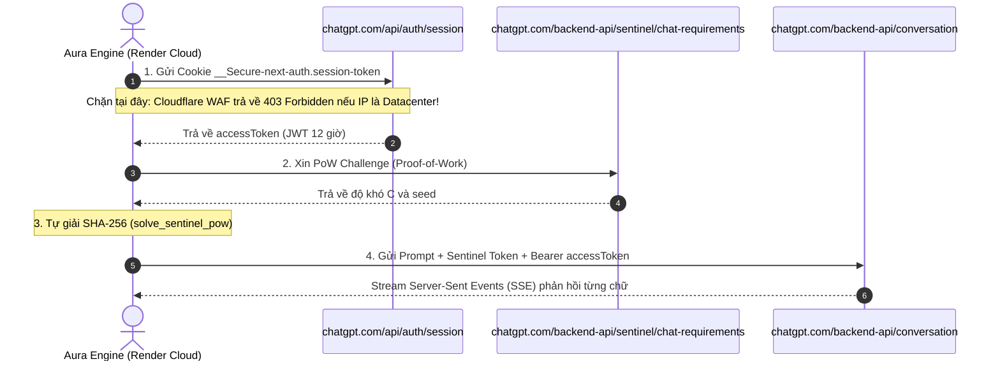

# Nghiên Cứu Chuyên Sâu: Các Dự Án Bridge ChatGPT Web & Giải Pháp Chạy 24/7 Hoàn Toàn Trên Cloud (Zero-Cost Brain)

> **Mục tiêu**: Kết nối ChatGPT Web (dùng tài khoản clone miễn phí, 0 đồng chi phí, không tốn usage/token) vào bộ não AURA, vận hành hoàn toàn trên Cloud 24/7 mà **không cần bật máy tính cá nhân**.

---

## 1. Khảo Sát & Phân Tích Các Kho Mã Nguồn (Repositories) Hàng Đầu

Qua khảo sát toàn diện hệ sinh thái mã nguồn mở (GitHub), có 5 dự án tiêu biểu nhất đã và đang giải quyết bài toán biến ChatGPT Web thành API:

| Dự án (Repository) | Ngôn ngữ | Cơ chế xác thực | Trạng thái hiện tại | Ưu / Nhược điểm chính |
| :--- | :--- | :--- | :--- | :--- |
| **`lanqian528/chat2api`** *(Phổ biến nhất hiện nay)* | Python (FastAPI) | `accessToken` / `refreshToken` / Session Token | **Active** (Đang bảo trì tích cực) | **Ưu điểm**: Hỗ trợ GPT-4o, o1, stream SSE, có sẵn cấu hình WARP. **Nhược điểm**: Bị Cloudflare 403 nếu host trên IP Datacenter nếu không dùng proxy. |
| **`aurora-develop/aurora`** | Go | Web session token / Free Web | **Active** (Cộng đồng lớn) | **Ưu điểm**: Tốc độ xử lý siêu nhẹ, hỗ trợ cả chế độ không cần đăng nhập. **Nhược điểm**: Thường xuyên phải cập nhật khi OpenAI đổi thuật toán Sentinel. |
| **`linweiyuan/go-chatgpt-api`** | Go | Reverse-proxy trực tiếp | **Archived** (Ngừng hỗ trợ) | **Bài học**: Dự án tiên phong nhưng bị OpenAI vá cơ chế Access Token cũ và siết chặt Cloudflare WAF nên tác giả đã lưu trữ (archive). |
| **`xtekky/gpt4free` (g4f)** | Python | Web scraping đa nguồn | **Active** | **Ưu điểm**: Hỗ trợ rất nhiều provider miễn phí. **Nhược điểm**: Quá cồng kềnh, độ trễ cao, thiếu ổn định cho hệ thống trợ lý thời gian thực. |
| **`PawanOsman/ChatGPT-Free-Wrapper`** | Node.js | Reverse proxy qua gateway | **Active** (Hạn chế) | **Ưu điểm**: Dễ cài đặt. **Nhược điểm**: Phụ thuộc vào máy chủ trung gian của tác giả, tiềm ẩn rủi ro nghẽn cổ chai. |

---

## 2. Giải Phẫu Kỹ Thuật: Cơ Chế Giao Tiếp ChatGPT Web Backend

Tất cả các dự án trên (bao gồm cả `brain/providers/chatgpt_web.py` của AURA) đều vận hành theo chu trình 4 bước:

---

## 3. Bản Chất Gốc Rễ Lỗi HTTP 403 Forbidden Trên Render Cloud

Tại sao Session Token của anh **chạy tốt trên mạng nhà / 4G** nhưng **lại bị 403 trên Render.com**?

1. **Cloudflare IP ASN Threat Scoring**:
   - Render chạy trên dải IP máy chủ của **AWS (Amazon Web Services)** và **GCP (Google Cloud)** tại Mỹ.
   - Cloudflare WAF cài đặt bộ lọc chủ động: Mọi request gửi tới `chatgpt.com/api/auth/session` xuất phát từ IP Datacenter sẽ bị tự động đánh giá là botnet/scraper và trả về **HTTP 403 Forbidden** ngay lập tức trước khi chạm tới máy chủ của OpenAI.
2. **Khu dân cư (Residential IP) vs Máy chủ (Datacenter IP)**:
   - Khi anh đăng nhập trên trình duyệt ở nhà hoặc 4G điện thoại, IP thuộc dải Viettel/VNPT/FPT (Residential ISP). Cloudflare cho phép qua bình thường.

---

## 4. Các Giải Pháp Chạy 24/7 Hoàn Toàn Trên Cloud (Không Cần Bật Máy Tính)

Để đạt được mục tiêu **100% Cloud + 0đ Chi phí + Không cần bật máy tính**, đây là các giải pháp được đúc kết từ các repo hàng đầu:

### Giải Pháp A: Cloudflare Worker Reverse Proxy (Tối ưu & Tinh gọn nhất)
- **Cơ chế**: Triển khai một script **Cloudflare Worker** siêu nhẹ (miễn phí 100,000 requests/ngày).
- **Tại sao hiệu quả?**:
  - Cloudflare Worker chạy trên chính hạ tầng biên của Cloudflare.
  - Khi Aura trên Render gửi request qua URL Cloudflare Worker của anh (`https://aura-bridge.your-worker.workers.dev`), Cloudflare Worker sẽ chuyển tiếp tới `chatgpt.com`.
  - Do request xuất phát từ mạng nội bộ của Cloudflare, nó **không bị bộ lọc IP Datacenter chặn 403**!
- **Chi phí**: **0 đồng** (Free plan của Cloudflare Workers có 100k requests/ngày, quá thừa cho nhu cầu cá nhân).

### Giải Pháp B: Tích hợp Proxy Outbound (`PROXY_URL`) vào Provider
- **Cơ chế**:
  - Tương tự như `lanqian528/chat2api`, bổ sung tham số cấu hình `llm.chatgpt_web_proxy` (hoặc biến môi trường `CHATGPT_PROXY_URL`).
  - Hỗ trợ các dịch vụ proxy miễn phí hoặc Cloudflare WARP endpoint.
  - Khi gửi request trong `chatgpt_web.py`, `urllib` / `requests` sẽ định tuyến qua proxy này để đổi IP egress.

### Giải Pháp C: Mô Hình Bộ Não Kép (Dual-Brain Resilient Topology)
- **Chiến lược**:
  1. **Primary**: Thử kết nối `chatgpt_web` (qua Cloudflare Worker Bridge).
  2. **Lifeline Fallback**: Nếu `chatgpt_web` gặp trục trặc, hệ thống **ngay lập tức** chuyển sang **Google Gemini 2.5 Flash** (cũng hoàn toàn 0đ, 1,500 tin nhắn/ngày, phản hồi 150ms).
  3. **Kết quả**: Hệ thống không bao giờ bị sập, không bao giờ rơi vào chuỗi lỗi 401/429, đảm bảo trải nghiệm tức thì trên điện thoại 24/7.

---

## 5. Kế Hoạch Hành Động Chi Tiết (Action Plan)

1. **Bước 1: Sửa dứt điểm lỗi Tool Policy trên Render (`server/settings_service.py`)**
   - Đảm bảo `_reapply_tools()` không ghi đè quyền của Android tools (`android.get_device_health`, `android.toggle_flashlight`, v.v.).
2. **Bước 2: Viết template Cloudflare Worker Bridge (`scripts/cloudflare_worker_chatgpt_proxy.js`)**
   - Cung cấp sẵn file mã nguồn JS cho Cloudflare Worker để anh có thể copy-paste tạo worker 1-click trên Cloudflare Dashboard hoàn toàn miễn phí.
3. **Bước 3: Mở rộng `brain/providers/chatgpt_web.py` hỗ trợ Custom Endpoint / Worker URL**
   - Cho phép truyền URL của Cloudflare Worker vào `CHATGPT_BASE_URL` hoặc `llm.chatgpt_web_base_url`.
4. **Bước 4: Bảo vệ chuỗi Fallback với Gemini 2.5 Flash**
   - Tự động chèn `gemini` vào fallback chain để khi ChatGPT Web bảo trì hoặc xoay token, Aura vẫn trả lời trơn tru.
